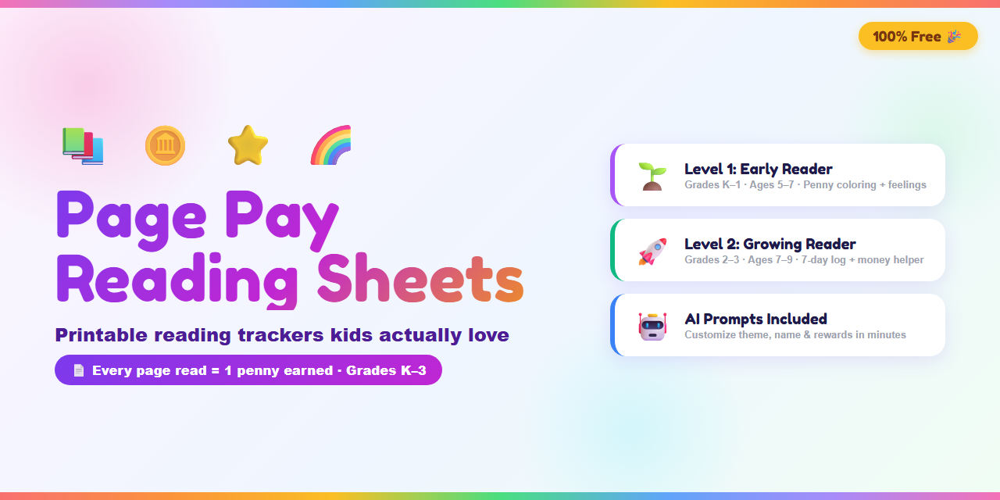

# 📚 Page Pay Reading Sheets

> **Free printable reading tracker worksheets for kids — where every page earns a penny!**

---

## 💛 Why Parents & Caregivers Love This

Getting kids to read consistently is one of the hardest — and most important — things we do as parents, teachers, and caregivers. Most reward systems are complicated, expensive, or feel disconnected from the actual habit you're building.

**Page Pay is different.** Here's why it works:

- 🧠 **It builds real math skills** — kids count their own pages, calculate their pennies, and learn that small consistent effort adds up to real rewards
- 💰 **The reward is tangible and immediate** — pennies are real money kids can see, touch, and save. A clear jar of pennies growing over weeks is *incredibly* motivating
- 📖 **It works with ANY book** — library books, school books, chapter books, picture books. No special materials needed
- 🎯 **It teaches tracking and accountability** — kids fill in their own sheet, building the habit of self-monitoring
- ✅ **It's screen-free and print-and-go** — no app, no subscription, no setup. Just print and start
- 🏫 **Perfect for summer reading, school nights, or reading programs** — use it at home, in the classroom, or at daycare

> *"What gets measured gets done — even for a 6-year-old."*

---

## 📄 The Two Levels

| Level | Best For | What's Included |
|-------|----------|-----------------|
| 🌱 **Level 1: Early Reader** | Grades K–1 · Ages 5–7 | Daily sheet · Penny coloring circles · Reading feelings · Book rating |
| 🚀 **Level 2: Growing Reader** | Grades 2–3 · Ages 7–9 | 7-day reading log · Full-book earnings formula · Money helper chart · Book reflection |

---

## 🖨️ How to Print (3 easy steps)

### Option A — Print the PDF directly (easiest)
1. Click the PDF file you want below
2. Click **Download**
3. Open the downloaded file → **Print** → Paper: **Letter (8.5×11")** · Layout: **Portrait** · Margins: **None**

📥 **Download PDFs:**
- [Level 1: Early Reader PDF](pdfs/Page_Pay_Reading_Sheet_Level1_Early_Reader.pdf)
- [Level 2: Growing Reader PDF](pdfs/Page_Pay_Reading_Tracker_Level2_Growing_Reader.pdf)

---

### Option B — Print from the HTML file (best quality)
1. Click the HTML file you want below → click **Raw** → Save the page (`Ctrl+S`)
2. Open the saved file in **Chrome or Edge**
3. Press `Ctrl+P` → set margins to **None** → **Print**

🌐 **HTML Files:**
- [Level 1: Early Reader HTML](html/Page_Pay_Reading_Sheet_Level1_Early_Reader.html)
- [Level 2: Growing Reader HTML](html/Page_Pay_Reading_Tracker_Level2_Growing_Reader.html)

---

## 💡 How the Page Pay System Works

1. **Before reading:** child writes the book name, date, and starting page
2. **After reading:** child fills in the stopping page and counts total pages read
3. **Earn pennies:** 1 page = 1 penny — count it out together!
4. **Celebrate:** color in the penny circles (Level 1) or add to the log (Level 2)

> 💡 **Pro tip:** Use a clear glass jar so kids can *see* their penny collection grow over time. The visual progress is a powerful motivator!

---

## 🤖 Customize With AI (Make It Your Own)

Want to add your child's name, change the theme to dinosaurs or space, or swap pennies for stickers? Use the included AI prompts with **ChatGPT, Claude, or GitHub Copilot** to generate a custom version in minutes.

📝 **Prompt Files:**
- [Level 1 Prompt + Customization Tips](prompts/level1-early-reader-prompt.md)
- [Level 2 Prompt + Customization Tips](prompts/level2-growing-reader-prompt.md)

**Ideas for customization:**
- 🦕 Change the theme — dinosaurs, unicorns, space, superheroes, sports
- 🏷️ Add your child's name to the title
- 🎁 Swap the reward — stickers, points, screen time minutes, anything!
- 📚 Adjust for older/younger readers by changing the grade level in the prompt

---

## 📁 Folder Structure

```
page-pay-reading-sheets/
├── README.md
├── banner.png
├── html/
│   ├── Page_Pay_Reading_Sheet_Level1_Early_Reader.html
│   └── Page_Pay_Reading_Tracker_Level2_Growing_Reader.html
├── pdfs/
│   ├── Page_Pay_Reading_Sheet_Level1_Early_Reader.pdf
│   └── Page_Pay_Reading_Tracker_Level2_Growing_Reader.pdf
└── prompts/
    ├── level1-early-reader-prompt.md
    └── level2-growing-reader-prompt.md
```

---

## 🌈 License

Free to use, print, and share with any child, classroom, or family. If you remix or improve these, please share back! 💛

*Created with love by a mom who wanted her kids to love reading — and math — at the same time.* 🌿
